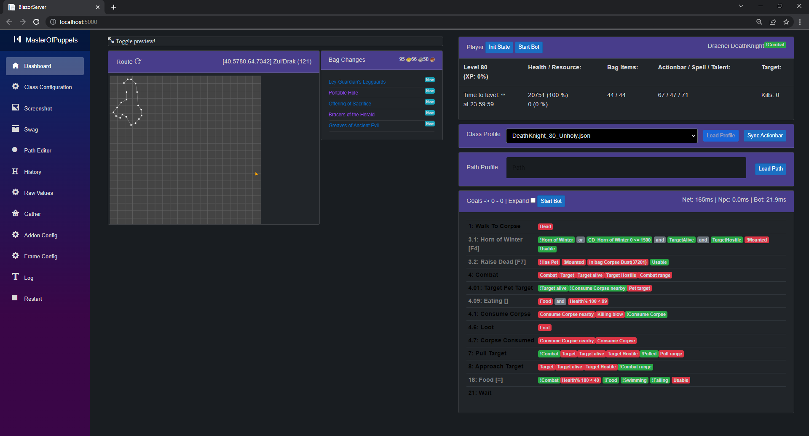
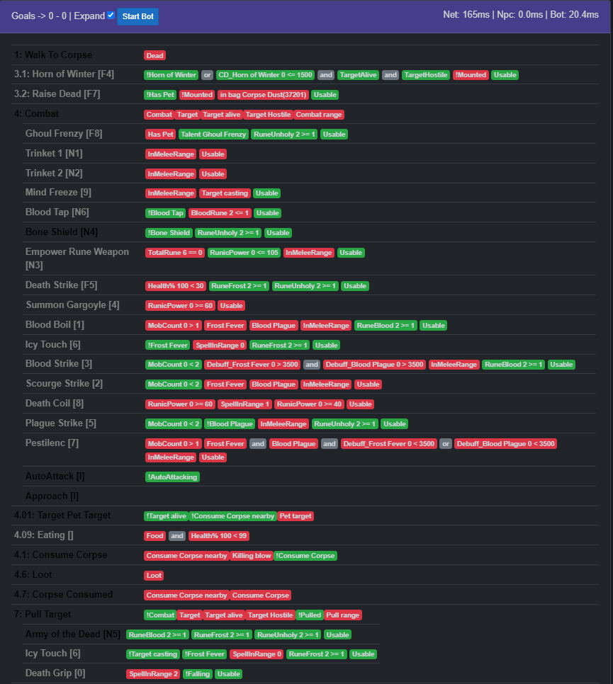

<p align="center">
  
</p>

# Master Of Puppets

- The project current goal is to support `Burning Crusade Classic`

- Addon: Modified [Happy-Pixels](https://github.com/FreeHongKongMMO/Happy-Pixels) to read the game state.

- Frontend: [ASP.NET Core Razor components](https://docs.microsoft.com/en-us/aspnet/core/blazor/components/).

- BlazorServer: [ASP.NET Core Blazor](https://docs.microsoft.com/en-us/aspnet/core/blazor) to show the state in a browser.

- HeadlessServer: Run from CommandLine without UI. Requires valid configuration files present next to the executable.

- Backend(Core/Game): written in C#. Screen capture, mouse and keyboard clicking. No memory tampering and DLL injection.

- Further detail about the architecture can be found in [Blog post](http://www.codesin.net/post/wowbot/).

- Pathing: Indoors pathfinding only works properly if `PathFilename` is exists. For outdoor there are multiple solutions:
    * V1 Local - In processs [PPather](https://github.com/Xian55/WowClassicGrindBot/tree/dev/PPather).
    * V1 Remote - Out of process [PathingAPI](https://github.com/Xian55/WowClassicGrindBot/tree/dev/PathingAPI).
    * V3 Remote - Out of process [AmeisenNavigation](https://github.com/Xian55/AmeisenNavigation/tree/feature/guess-z-coord-after-rewrite)

# Features

- Game fullscreen or windowed mode
- Addon supports all available client languages
- Most of the classes should work. Some classes have more support than others.
- Highly configurable Combat rotation described in `ClassConfiguration`
- Utilizing the Actionbar related APIs to retrive ActionbarSlot(usable, cost)
- Based on the `ClassConfiguration` file populate Actionbar
- Pathfinding in the current zone to the grind location
- Grind mobs in the described `PathFilename`
- Blacklist certain NPCs
- Loot and GatherCorpse (Skin, Herb, Mine, Salvage)
- Vendor goods
- Repair equipments
- Corpse run
- Semi automated gathering [mode](#Modes)

# Media

<a href="./images/Screenshot.png" target="_blank">
   
</a>

[](https://www.youtube.com/watch?v=CIMgbh5LuCc)

<a href="https://mega.nz/file/vf5BhZiJ#yX77HpxremieqGPQSUgZn55bPqJPz6xRLq2n-srt8eY" target="_blank">
   
</a>

<a href="https://mega.nz/file/KDRiCAzI#DamyH3QCha8vm4qfhqVYRb6ffbkhvfyZxWhz9D1OKEc" target="_blank">
   
</a>

# Issues and Ideas

Create an issue with the given template.

# Contributing

You are welcome to create pull requests. Some ideas of things that could be improved:

* This readme
* More route and class profiles

# Contribution

* Frontend Runtime Class Profile picker
* Frontend Runtime Path Profile autocomplete search
* Frontend Dark mode
* Improved Loot Goal
* Added Skinning Goal -> GatherCorpse (Skin, Herb, Mine, Salvage)
* Introduced a concept of `Produce`/`Consume` corpses. Killing multiple enemies in a single combat, can consume them all.
* `ActionbarPopulator` based on class config
* `DataConfig`: change where the external data(DBC, MPQ, profiles) can be found
* Edit the loaded profile from frontend
* `NPCNameFinder`: extended to friendly/neutral units
* Remap essential keybindings and support more Actionbar slots up to `34`
* Added a new input system to handle modifier keys
* Support more 4:3 aspect ratio based resolution
* Addon is rewritten/reorganized with performance in mind(caching and reduce cell paint) to achive game refresh rate speed

# Getting it working

## 1. Download this repository

Put the contents of the repo into a folder. e.g `C:\WowClassicGrindBot`. I am going to refer to this folder from now on, so just substitute your own folder path.

## 2.1 Using V1 Local/Remote Pathhing

Download the MPQ route files.
This files are required for to find paths from where you are to the grind area, vendor and repair.

* Classic: [**common-2.MPQ**](https://mega.nz/file/vXQCBCha#m7COhB9HQd86a5iNAT0-fMLsc-BtoTRO1eIBJNrdTH8) (1.7Gb)
* TBC: [**expansion.MPQ**](https://mega.nz/file/Of4i2YQS#egDGj-SXi9RigG-_8kPITihFsLom2L1IFF-ltnB3wmU) (1.8Gb)
* WOTLK: [**lichking.MPQ**](https://mega.nz/file/vDYWSTrK#fvaiuHpd-FTVsQT4ghGLK6QJLZyA87c1rlBEeu1_Btk) (2.5Gb)

Copy the previusly mentioned files to **\Json\MPQ** folder (e.g. `C:\WowClassicGrindBot\Json\MPQ`)

## 2.2 Using V3 Remote Pathing

Download the navmesh files.

* [**Classic + TBC**](https://mega.nz/file/7HgkHIyA#c_gzUeTadecWY0JDY3KT39ktfPGLs2vzt_90bMvhszk)

1. Extract and copy anywhere you want. like `C:\mmaps`
1. Create a build of [AmeisenNavigation](https://github.com/Xian55/AmeisenNavigation/tree/feature/guess-z-coord-after-rewrite)
1. Navigate to the build location and find `config.cfg`
1. Edit the file last line to look as `sMmapsPath=C:\mmaps`

## 3.1 System / Video Requirements

Resultions which based on either 4:3 aspect ratio, tested resolutions:
* 1024 x 768
* 1920 x 1080
* 3840 x 2160

For Nvidia users, under Nvidia Control panel settings
* Make sure the `Image Sharpening` under the `Manage 3D Settings`-> Global settings or Program Settings(for WoW) is set to `Sharpening Off, Scaling disabled`!

## 3.2 In-game Requirements

Required game client settings. Press `ESC` -> `System`
  * System > Advanced > Constrast: `50`
  * System > Advanced > Brightness: `50`
  * System > Advanced > Gamma from: `1.0`
  * System > Render Scale: `100%`
  * Disable Glow effect - type in the chat `/console ffxGlow 0`
  * To keep/save this settings make sure to properly shutdown the game.

## 3.3 Optional - Replace default game Font

Highly suggested to replace the default game font with a much **Bolder** one with [this guide](https://classic.wowhead.com/guides/changing-wow-text-font)

Should be only concerned about `Friz Quadrata: the "Everything Else" Font` which is the `FRIZQT__.ttf` named file.

Example - [Robot-Medium](https://fonts.google.com/specimen/Roboto?thickness=5) - Shows big improvement to the `NpcNameFinder` compontent which is responsible to find - friendly, enemy, corpse - names above NPCs head.

## 4.1 Build Requirements

* Windows 7 and above
* [.NET 6.0 SDK](https://dotnet.microsoft.com/download/dotnet/6.0)
* **Note:** By default all builds will be **x86**.

## 4.2 Build the solution

One of the following IDE or command line
* Visual Studio
* Visual Studio Code
* Powershell

e.g. Build from Powershell
```ps
cd C:\WowClassicGrindBot
dotnet build --configuration Release
```


## 5. BlazorServer Configuration process

The app reads the game state using small blocks of colour shown at the top of the screen by an Addon. This needs to be configured.

1. Edit the batch script in `C:\WowClassicGrindBot\BlazorServer` called `run.bat`, change it to point at where you have put the repo BlazorServer folder

    e.g.
    ```ps
    start "C:\Program Files (x86)\Google\Chrome\Application\chrome.exe" "http://localhost:5000"
    c:
    cd C:\WowClassicGrindBot\BlazorServer
    dotnet run --configuration Release
    pause
    ```

2. Execute the `run.bat`. This will start the bot and Chrome, Wow must be already running. If you get `"Unable to find the Wow process is it running ?"` in the console window then it can't find exe.

3. When running the BlazorServer for the first time you will have to follow a setup process:
    * Just start the game and wait in the character selection screen.
    * Click `2. Addon Configuration`
    * Click `Find InstallPath` -> `InstallPath` should be filled otherwise, fill out manually
    * Fill out `Author` freely
    * Fill out `Title` freely
    * Then press `Install & Save` button -> Log should see `AddonConfigurator.Install successful`
    * Required to restart the Game 
    * Enter world with your desired character
    * Click `5. Frame Configuration`
    * [Guidance for good DataFrame](../../wiki/Guidance-for-good-DataFrame)
    * Click `Auto Configure and Restart`
    * [Validate FrameConfiguration](../../wiki/Validating-FrameConfiguration)

4. Under the `Addon Configuration` you can check if theres a **newer version available** for the addon. In that case just press the `install` button then have to restart the game client and the bot it self in order to use it properly. 

## 6. BlazorServer should restart and show the dashboard page.

## 7 Optional - Running HeadlessServer

Similar to BlazorServer project, except without Frontend. Should consume less system resources with a compromise of lacking runtime tweaking ability.

Everything has to be setup inside the Class Configuration, in prior.

A successful [Configuration process](#5-BlazorServer-Configuration-process) has a result of a following configuration files
* `data_config.json`
* `addon_config.json`
* `frame_config.json`

In order to run `HeadlessServer` please look at the `HeadlessServer\run.bat`.

e.g. run from Powershell
```ps
cd C:\WowClassicGrindBot\HeadlessServer
.\run.bat Hunter_1.json
```

## 8. Configure the Wow Client - Interface Options

Need to make sure that certain interface options are set. The most important are `Click-to-Move` and `Do Not Flash Screen at Low Health`.

From the main menu (ESC) set the following under Interface Options:

| Interface Option | Value |
| ---- | ---- |
| Controls - Auto Loot | &#9745; |
| Controls - Interact on Left click | &#9744; |
| Combat - Do Not Flash Screen at Low Health | &#9745; |
| Combat - Auto Self Cast | &#9745; |
| Names - NPC Names | &#9745; |
| Names - Enemy Units (V) | &#9744; |
| Camera - Auto-Follow Speed | **Fast** |
| Camera - Camera Following Style | **Always** |
| Mouse - Click-to-Move | &#9745; |
| Mouse - Click-to-Move Camera Style | **Always** |

## 9. Configure the Wow Client - Key Bindings

From the main menu (ESC) -> `Key Bindings` set the following:

`Movement Keys`:

| In-Game | ClassConfiguration Name | Default ConsoleKey | Desciption |
| ---- | ---- | ---- | ---- |
| Move Forward | ForwardKey | UpArrow | Change this to `87` for pressing `W` |
| Move Backward | BackwardKey | DownArrow | Change this to `83` for pressing `S` |
| Turn Left | TurnLeftKey | LeftArrow | Change this to `65` for pressing `A` |
| Turn Right | TurnRightKey | RightArrow | Change this to `68` for pressing `D` |
| Jump | JumpKey | Spacebar | ---- |
| Sit/Move down | StandUpKey | X |  Used after drinking or eatin |

To change the default movement keys to `WASD` in the ClassConfiguration file or look at the example `Json\class\Warrior_1_MovementKeys.json`
```json
"ForwardKey": 87,   // W
"BackwardKey": 83,  // S
"TurnLeftKey": 65,  // A
"TurnRightKey": 68, // D
```

`Targeting`:
| In-Game | Key | ClassConfiguration KeyAction Name | Desciption |
| ---- | ---- | ---- | ---- |
| Target Nearest Enemy | Tab | TargetNearestTargetKey | ---- |
| Target Pet | Multiply | TargetPetKey | Only pet based class |
| Target Last Target | G | TargetLastTargetKey | ---- |
| Interact With Target | I | InteractKey | ---- |
| Assist Target | F | TargetTargetOfTargetKey | ---- |
| Pet attack | Subtract | PetAttackKey | Only pet based class |
| Target Focus | PageUp | TargetFocusKey | Only for `"AssistFocus"` Mode |

The `"Interact with Target"` keybind is super important as it allows the bot to turn towards and approach the target.
The `"Target Last Target"` keybind helps with looting.

## 10.1. Actionbar Key Bindings:

The default class profiles assumes the following `Keybinds` setup and using English Keyboard layout.
In total, `36` key supported.

Highly recommended to use the default setup, in order to get properly working the `ActionBarSlotCost` and `ActionBarSlotUsable`!

| ActionSlot | Key | Description |
| --- | --- | --- |
| 1-12 | 1,2,3 .. 9,0,-,= | 0 is the 10th key. |
| Bottom Right ActionBar | - | - |
| 49-58 | N1,N2,N3 .. N9,N0 | N means Numpad - 0 is the 10th key |
| Bottom Left ActionBar | - | - |
| 61-72 | F1,F2,F3 .. F11,F12 | F means Functions |

## 11. Configure the Wow Client - Bindpad addon

Bindpad allows keys to be easily bound to commands and macros. Type `/bindpad` to show it.

For each of the following click + to add a new key binding.

|  Key |  Command | Note |
| ---- | ---- | ---- |
| Delete | /stopattack<br>/stopcasting<br>/petfollow | ---- |
| Insert | /cleartarget | ---- |
| PageDown | /follow | Only for `"AssistFocus"` Mode |

## 12. Class Configuration

Each class has a configuration file in `\Json\class` e.g. the config for a Rogue it is in file `C:\WowClassicGrindBot\Json\class\Rogue.json`.

The configuration file determines what spells you cast when pulling and in combat, where to vendor and repair and what buffs you give yourself.

Take a look at the class files in `/Json/class` for examples of what you can do. Your class file probably exists and just needs to be edited to set the pathing file name, but note they may be set up for level 60.

| Property Name | Description | Optional | Default value |
| --- | --- | --- | --- |
| `"Log"` | Should logging enabled for `KeyAction(s)`. Requires restart. | true | `true` |
| `"Loot"` | Should loot the mob | true | `true` |
| `"Skin"` | Should skin the mob | true | `false` |
| `"Herb"` | Should herb the mob | true | `false` |
| `"Mine"` | Should mine the mob | true | `false` |
| `"Salvage"` | Should salvage the mob | true | `false` |
| `"UseMount"` | Should use mount when its possible | true | `false` |
| `"KeyboardOnly"` | Use keyboard to interact only. See [KeyboardOnly](#KeyboardOnly) | false | `true` |
| `"PathFilename"` | [Path](#Path) to use while alive | **false** | `""` |
| `"PathThereAndBack"` | While using the path, [should go start to and reverse](#There-and-back) | true | `true` |
| `"PathReduceSteps"` | Reduce the number of path points | true | `false` |
| `"Mode"` | What kind of [behaviour](#Modes) should the bot operate | true | `Mode.Grind` |
| `"NPCMaxLevels_Above"` | Maximum allowed level above difference to the player | true | `1` |
| `"NPCMaxLevels_Below"` | Maximum allowed level below difference to the player | true | `7` |
| `"CheckTargetGivesExp"` | Only engage the target if it yields experience | true | `false` |
| `"Blacklist"` | List of names or sub names which must be avoid engaging | true | `[""]` |
| `"ImmunityBlacklist"` | List of Npc ids which have some sort of `School` immunities | true | `""` |
| `"IntVariables"` | List of user defined `integer` variables | true | `[]` |
| --- | --- | --- | --- |
| `"Pull"` | Sequence of `KeyAction(s)` to execute upon [Pull Goal](#Pull-Goal) | true | `[]` |
| `"Combat"` | Sequence of `KeyAction(s)` to execute upon [Combat Goal](#Combat-Goal) | **false** | `[]` |
| `"Adhoc"` | Sequence of `KeyAction(s)` to execute upon [Adhoc Goals](#Adhoc-Goals) | true | `[]` |
| `"Parallel"` | Sequence of `KeyAction(s)` to execute upon [Parallel Goal](#Parallel-Goals) | true | `[]` |
| `"NPC"` | Sequence of `KeyAction(s)` to execute upon [NPC Goal](#NPC-Goals) | true | `[]` |
| --- | --- | --- | --- |
| `"GatherFindKeys"` | List of strings for switching between gathering profiles | true | `string[]` |
| `"JumpKey"` | `Consolekey` to be pressed on Jump | true | `"Spacebar"` |
| `"InteractKey"` | `Consolekey` to be pressed on Interact | true | `"I"` |
| `"TargetLastTargetKey"` | `Consolekey` to be pressed to Target last target | true | `"G"` |
| `"StandUpKey"` | `Consolekey` to be pressed to stand up | true | `"X"` |
| `"ClearTargetKey"` | `Consolekey` to be pressed to clear current target | true | `"Insert"` |
| `"StopAttackKey"` | `Consolekey` to be pressed to stop attack | true | `"Delete"` |
| `"TargetNearestTargetKey"` | `Consolekey` to be pressed to target nearest target | true | `"Tab"` |
| `"TargetTargetOfTargetKey"` | `Consolekey` to be pressed to target - target of target | true | `"F"` |
| `"TargetPetKey"` | `Consolekey` to be pressed to target pet | true | `"Multiply"` |
| `"PetAttackKey"` | `Consolekey` to be pressed to send attack pet | true | `"Subtract"` |
| `"MountKey"` | `Consolekey` to be pressed to use mount | true | `"O"` |
| `"HearthstoneKey"` | `Consolekey` to be pressed to use hearthstone | true | `"I"` |
| `"ForwardKey"` | `Consolekey` to be pressed to move forward | true | `"UpArrow"` |
| `"BackwardKey"` | `Consolekey` to be pressed to move backward | true | `"DownArrow"` |
| `"TurnLeftKey"` | `Consolekey` to be pressed to turn left | true | `"LeftArrow"` |
| `"TurnRightKey"` | `Consolekey` to be pressed to turn right | true | `"RightArrow"` |

### KeyboardOnly

By Default, the bot attempts to use the mouse for the following reasons:
* (during `Follow Route`) Target selection
* (during `Consume Corpse`) `"Loot"`
* (during `Consume Corpse`) GatherCorpse(`"Skin"`, `"Herb"`, `"Mine"`, `"Salvage"`)

You can disable this behaviour by setting `KeyboardOnly` to `true`. Which has the following effects:
* `"Loot"` limited, only capable of looting by selecting last target. So after each combat only the **last npc** can be looted.
* GatherCorpse(`"Skin"`, `"Herb"`, `"Mine"`, `"Salvage"`) unavailable.
* Target selection limited to only `TargetNearestTargetKey`, which significantly reduce how quickly can find the next target.

### IntVariables

Gives the ability to the user to define global integer variables along the whole ClassConfiguration scope. 

For example look at the Warlock profiles.
```json
"IntVariables": {
    "DOT_MIN_HEALTH%": 35,
    "Debuff_Frost Fever": 237522,   // iconId https://www.wowhead.com/icons
    "Debuff_Blood Plague": 237514,  // iconId https://www.wowhead.com/icons
}
```

### Path

The path that the class follows is a `json` file in `/Json/path/` which contains a list of `x` & `y` coordinates the bot will traverse while looking for mobs.
```json
"PathFilename": "58_Winterspring.2.json",   // the path to walk when alive
"PathThereAndBack": true,                   // if true walks the path and the walks it backwards.
"PathReduceSteps": true,                    // uses every other coordinate.
```
### **KeyAction** - Commands

Each `KeyAction` has its own properties to describe what the action is all about. 

Can specify conditions with [Requirement(s)](#Requirement) in order to create a matching action for the situation.

| Property Name | Description | Default value |
| --- | --- | --- |
| `"Name"` | Name of the KeyAction. For the `ActionBarPopulator`, lowercase means macro. | `""` |
| `"Key"` | Key to press (`ConsoleKey`) | `""` |
| `"Cost"` | [Adhoc Goals](#Adhoc-Goals) or [NPC Goal](#NPC-Goals) only, priority | `18` |
| `"PathFilename"` | [NPC Goal](#NPC-Goals) only, this is a short path to get close to the NPC to avoid walls etc. | `""` |
| `"HasCastBar"` | After key press cast bar is expected?<br>By default sets `BeforeCastStop`=`true` | `false` |
| `"InCombat"` | Should combat matter when attempt to cast?<br>Accepted values:<br>* `"any value for doesn't matter"`<br>* `"true"`<br>* `"false"` | `false` |
| `"Item"` | Like on use Trinket, `Food`, `Drink`.<br>The following spells counts as Item, `Throw`, `Auto Shot`, `Shoot` | `false` |
| `"PressDuration"` | How many milliseconds to hold the key press | `50` |
| `"Form"` | Shapeshift/Stance form to be in to cast this spell<br>If setted, affects `WhenUsable` | `Form.None` |
| `"Cooldown"` | **Note this is not the in-game cooldown!**<br>The time in milliseconds before KeyAction can be used again.<br>This property will be updated when the backend registers the `Key` press. It has no feedback from the game. | `400` |
| `"Charge"` | How many consequent key press should happen before setting Cooldown | `1` |
| `"School"` | Indicate what type of element the spell do. Accepted values:<br>* `SchoolMask.Physical`<br>* `SchoolMask.Holy`<br>* `SchoolMask.Fire`<br>* `SchoolMask.Nature`<br>* `SchoolMask.Frost`<br>* `SchoolMask.Shadow`<br>* `SchoolMask.Arcane` | `SchoolMask.None` |
| --- | --- | --- |
| `"WhenUsable"` | Mapped to [IsUsableAction](https://wowwiki-archive.fandom.com/wiki/API_IsUsableAction) | `false` |
| `"UseWhenTargetIsCasting"` | Checks for the target casting/channeling.<br>Accepted values:<br>* `null` -> ignore<br>* `false` -> when enemy not casting<br>* `true` -> when enemy casting | `null` |
| `"Requirement"` | Single [Requirement](#Requirement) | `false` |
| `"Requirements"` | List of [Requirement](#Requirement) | `false` |
| `"ResetOnNewTarget"` | Reset the Cooldown if the target changes | `false` |
| `"Log"` | Related events should appear in the logs | `true` |
| --- | Before keypress cast, ... | --- |
| `"BeforeCastStop"` | stop moving. | `false` |
| `"BeforeCastDelay"` | delay in milliseconds | `0` |
| --- | After Successful cast, ... | --- |
| `"AfterCastWaitSwing"` | wait for next melee swing to land.<br>Blocks **CastingHandler**. | `false` |
| `"AfterCastWaitCastbar"` | wait for the castbar to finish, `SpellQueueTimeMs` excluded.<br>Blocks **CastingHandler**. | `false` |
| `"AfterCastWaitBuff"` | wait for Aura=__(player-target debuff/buff)__ count changes.<br>Only works properly, when the Aura **count** changes.<br>Not suitable for refreshing already existing Aura<br>Blocks **CastingHandler**. | `false` |
| `"AfterCastAuraExpected"` | refreshing Aura=__(player-target debuff/buff)__<br>Just adds an extra(`SpellQueueTimeMs`) Cooldown to the action, so it wont repeat itself.<br>Not blocking  **CastingHandler**. | `false` |
| `"AfterCastWaitBag"` | wait for inventory, bag change.<br>Blocks **CastingHandler**. | `false` |
| `"AfterCastWaitCombat"` | wait for player entering combat.<br>Blocks **CastingHandler**. | `false` |
| `"AfterCastWaitMeleeRange"` | wait for interrupted either:<br>* target enters melee range<br>* target starts casting<br>* player receives damage<br>Blocks **CastingHandler**. | `false` |
| `"AfterCastStepBack"` | start backpedaling for milliseconds.<br>If value set to `-1` attempts to use the whole remaining GCD duration.<br>Blocks **CastingHandler**. | `0` |
| `"AfterCastWaitGCD"` | the Global cooldown fully expire.<br>Blocks **CastingHandler**. | `0` |
| `"AfterCastDelay"` | delay in milliseconds.<br>Blocks **CastingHandler**. | `0` |
| --- | --- | --- |

Some of these properties are optional and not required to be specified.

However you can create complex conditions and branches to suit the situation.

Important, the `AfterCast` prefixed conditions order as is its shows up the the table above.

e.g. - bare minimum for a spell which has castbar.
```json
{
    "Name": "Frostbolt",
    "Key": "1",
    "HasCastBar": true,   //<-- Must be indicated the spell has a castbar
}
```

e.g. - bare minimum for a spell which is instant (no castbar)
```json
{
    "Name": "Earth Shock",
    "Key": "6"
}
```

e.g. for Rogue ability
```json
{
    "Name": "Slice and Dice",
    "Key": "3",
    "Requirements": [
        "!Slice and Dice",
        "Combo Point > 1"
    ]
}
```

Theres are few specially named KeyAction such as `Food` and `Drink` which is reserved for eating and drinking.

They already have some prebaked `Requirement` conditions in order to avoid mistype the definition. 

The bare minimum for `Food` and `Drink` is looks something like this.
```json
{
    "Name": "Food",
    "Key": "-",
    "Requirement": "Health% < 50"
},
{
    "Name": "Drink",
    "Key": "=",
    "Requirement": "Mana% < 50"
}
```
---

### Casting Handler

**CastingHandler** is a component which responsible for handling player spell casting, 
let it be using an item from the inventory, casting an instant spell or casting a spell which has castbar.

From Addon version **1.6.0** it has been significantly changed to the point where it no longer blocks the execution until the castbar fully finishes, but rather gives back the control to the parent Goal such as [Adhoc Goals](#Adhoc-Goals) or [Pull Goal](#Pull-Goal) or [Combat Goal](#Combat-Goal) to give more time to find the best suitable action for the given moment.

As a result in order to execute the [Pull Goal](#Pull-Goal) sequence in respect, have to combine its `KeyAction(s)` with `AfterCast` prefixed conditions.

---
### Pull Goal

This is the `Sequence` of `KeyAction(s)` that are used when pulling a mob.

e.g.
```json
"Pull": {
    "Sequence": [
        {
            "Name": "Concussive Shot",
            "Key": "9",
            "BeforeCastStop": true,
            "Requirements": ["HasRangedWeapon", "!InMeleeRange", "HasAmmo"]
        }
    ]
}
```

### Combat Goal

The `Sequence` of `KeyAction(s)` that are used when in combat and trying to kill a mob. 

The combat goal does the first available command on the list. 

The goal then runs again re-evaluating the list before choosing the first available command again, and so on until the mob is dead.

e.g.
```json
"Combat": {
    "Sequence": [
        {
            "Name": "Fireball",
            "Key": "2",
            "HasCastBar": true,
            "Requirement": "TargetHealth% > 20"
        },
        {
            "Name": "AutoAttack",
            "Requirement": "!AutoAttacking"
        },
        {
            "Name": "Approach",
            "Log": false
        }
    ]
}
```

### Adhoc Goals

These `Sequence` of `KeyAction(s)` are done when not in combat and are not on cooldown. Suitable for personal buffs.

e.g.
```json
"Adhoc": {
    "Sequence": [
        {
            "Name": "Frost Armor",
            "Key": "3",
            "Requirement": "!Frost Armor"
        },
        {
            "Name": "Food",
            "Key": "=",
            "Requirement": "Health% < 30"
        },
        {
            "Name": "Drink",
            "Key": "-",
            "Requirement": "Mana% < 30"
        }
    ]
}
```

### Parallel Goals

These `Sequence` of `KeyAction(s)` are done when not in combat and are not on cooldown. 

The keypresses happens simultaneously on all `KeyAction(s)` which mets the `Requirement`.

Suitable for `Food` and `Drink`.

e.g.
```json
"Parallel": {
    "Sequence": [
        {
            "Name": "Food",
            "Key": "=",
            "Requirement": "Health% < 50"
        },
        {
            "Name": "Drink",
            "Key": "-",
            "Requirement": "Mana% < 50"
        }
    ]
}
```
### NPC Goals

These command are for vendoring and repair.

e.g.
```json
"NPC": {
    "Sequence": [
    {
        "Name": "Repair",
        "Key": "C",
        "Requirement": "Items Broken",
        "PathFilename": "Tanaris_GadgetzanKrinkleGoodsteel.json",
        "Cost": 6
    },
    {
        "Name": "Sell",
        "Key": "C",
        "Requirement": "BagFull",
        "PathFilename": "Tanaris_GadgetzanKrinkleGoodsteel.json",
        "Cost": 6
    }
    ]
}
```

The "Key" is a key that is bound to a macro. The macro needs to target the NPC, and if necessary open up the repair or vendor page. The bot will click the key and the npc will be targetted. Then it will click the interact button which will cause the bot to move to the NPC and open the NPC options, this may be enough to get the auto repair and auto sell greys to happen. But the bot will click the button again in case there are further steps (e.g. SelectGossipOption), or you have many greys or items to sell.

e.g. Sell macro - bound to the `"C"` key using BindPad or Key bindings
```cs
/tar Jannos Ironwill
/run DataToColor:sell({"Light Leather","Cheese","Light Feather"});
```

e.g. Repair macro
```cs
/tar Vargus
/script SelectGossipOption(1)
```

e.g. Delete various items
```cs
/run for b=0,4 do for s=1,GetContainerNumSlots(b) do local n=GetContainerItemLink(b,s) if n and (strfind(n,"Slimy") or strfind(n,"Red Wolf") or strfind(n,"Mystery") or strfind(n,"Spider L")) then PickupContainerItem(b,s) DeleteCursorItem() end end end
```

Because some NPCs are hard to reach, there is the option to add a short path to them e.g. `"Tanaris_GadgetzanKrinkleGoodsteel.json"`. The idea is that the start of the path is easy to get to and is a short distance from the NPC, you record a path from the easy to reach spot to the NPC with a distance between spots of 1. When the bot needs to vend or repair it will path to the first spot in the list, then walk closely through the rest of the spots, once they are walked it will press the defined Key, then walk back through the path.

e.g. `Tanaris_GadgetzanKrinkleGoodsteel.json` in the `Json/path` folder looks like this:
```json
[{"X":51.477,"Y":29.347},{"X":51.486,"Y":29.308},{"X":51.495,"Y":29.266},{"X":51.503,"Y":29.23},{"X":51.513,"Y":29.186},{"X":51.522,"Y":29.147},{"X":51.531,"Y":29.104},{"X":51.54,"Y":29.063},{"X":51.551,"Y":29.017},{"X":51.559,"Y":28.974},{"X":51.568,"Y":28.93},{"X":51.578,"Y":28.889},{"X":51.587,"Y":28.853},{"X":51.597,"Y":28.808}]
```
If you have an NPC that is easy to get to such as the repair NPC in Arathi Highlands then the path only needs to have one spot in it. e.g.
```json
[{"X":45.8,"Y":46.6}]
```

Short Path Example:


### Repeatable Quests Handin

In theory if there is a repeatable quest to collect items, you could set up a NPC task as follows. See 'Bag requirements' for Requirements format.
```json
{
    "Name": "Handin",
    "Key": "K",
    "Requirements": ["BagItem:12622:5","BagItem:12623:5"],
    "PathFilename": "Path_to_NPC.json",
    "Cost": 6
}
```

# Requirement

A requirement is something that must be evaluated to be `true` for the `KeyAction` to run. 

Not all `KeyAction` requires requirement(s), some rely on
* `Cooldown` - populated manually
* `ActionBarCooldownReader` - populated automatically
* `ActionBarCostReader` - populated automatically including (`MinMana`, `MinRage`, `MinEnergy`, `MinRunicPower`, `MinRuneBlood`, `MinRuneFrost`, `MinRuneUnholy`)

Can specify `Requirements` for complex condition.

e.g.
```json
{
    "Name": "Execute",                                            //<--- Has no Requirement
    "Key": "7",
    "WhenUsable": true
},
{
    "Name": "Soul Shard",
    "Key": "9",
    "HasCastBar": true,
    "Requirements": ["TargetHealth% < 36", "!BagItem:6265:3"]     //<--- Requirement List
},
{
    "Name": "Curse of Weakness",
    "Key": "6",
    "WhenUsable": true,
    "Requirement": "!Curse of Weakness"                           //<--- Single Requirement
}
```

### **Negate a requirement**

Every requirement can be negated by adding one of the `Negate keyword` in front of the requirement.

Formula: `[Negate keyword][requirement]`

| Negate keyword |
| --- |
| `"not "` |
| `"!"` |

e.g.
```json
"Requirement": "not Curse of Weakness"
"Requirement": "!BagItem:Item_Soul_Shard:3"
```
---

### **And / Or multiple Requirements**

Two or more Requirement can be merged into a single Requirement object. 

By default every Requirement is concataneted with `[and]` operator which means in order to execute the `KeyAction`, every member in the `RequirementsObject` must be evaluated to `true`. However this consctruct allows to concatanete with `[or]`. Nesting parenthesis are also supported.

Formula: `[Requirement1] [Operator] [RequirementN]`

| Operator | Description |
| --- | --- |
| "&&" | And |
| "\|\|" | Or |

e.g.
```json
"Requirements": ["Has Pet", "TargetHealth% < 70 || TargetCastingSpell"]
"Requirement": "!Form:Druid_Bear && Health% < 50 || MobCount > 2",
"Requirement": "(Judgement of the Crusader && CD_Judgement <= GCD && TargetHealth% > 20) || TargetCastingSpell"
```
---
### **Value base requirements**

Value base requirement is the most basic way to create a condition. 

Formula: `[Keyword] [Operator] [Numeric integer value]`

**Note:** `[Numeric integer value]` always the _right-hand_ side expression value

| Operator | Description | 
| --- | --- |
| `==` | Equals |
| `<=` | Less then or Equals |
| `>=` | Greater then or Equals |
| `<` | Less then |
| `>` | Greater then |

| Keyword | Description |
| --- | --- |
| `Health%` | Player health in percentage |
| `TargetHealth%` | Target health in percentage |
| `PetHealth%` | Pet health in percentage |
| `Mana%` | Player mana in percentage |
| `Mana` | Player current mana |
| `Rage` | Player current rage |
| `Energy` | Player current energy |
| `RunicPower` | Player current runic power |
| `BloodRune` | Player current blood runes |
| `FrostRune` | Player current frost runes |
| `UnholyRune` | Player current unholy runes |
| `TotalRune` | Player current runes (blood+frost+unholy+death) |
| `Combo Point` | Player current combo points on the target |
| `BagCount` | How many items in the player inventory |
| `MobCount` | How many detected, alive, and currently fighting mob around the player |
| `MinRange` | Minimum distance(yard) between the player and the target  |
| `MaxRange` | Maximum distance(yard) between the player and the target |
| `LastAutoShotMs` | Time since last detected AutoShot happened in milliseconds |
| `LastMainHandMs` | Time since last detected Main Hand Melee swing happened in milliseconds |
| `MainHandSpeed` | Returns the player Main hand attack speed in milliseconds |
| `MainHandSwing` | Returns the player predicted next main hand swing time |
| `CD` | Returns the context KeyAction **in-game** cooldown in milliseconds |
| `CD_{KeyAction.Name}` | Returns the given `{KeyAction.Name}` **in-game** cooldown in milliseconds |
| `Cost_{KeyAction.Name}` | Returns the given `{KeyAction.Name}` cost value |
| `Buff_{IntVariable_Name}` | Returns the given `{IntVariable_Name}` remaining player buff up time |
| `Debuff_{IntVariable_Name}` | Returns the given `{IntVariable_Name}` remaining target debuff up time |
| `CurGCD` | Returns the player current remaining GCD time |
| `GCD` | Alias for `1500` value |
| `SpellQueueTime` | Alias for `400` value |
| `NextSpell` | Alias for `1900` value |

For the `MinRange` and `MaxRange` gives an approximation range distance between the player and target.

**Note:** _Every class has it own unique way to find these values by using different in game items/spells/interact._

| MinRange | MaxRange | alias Description |
| --- | --- | --- |
| 0 | 5 | "InMeleeRange" |
| 5 | 15 | "IsInDeadZoneRange" |

Its worth mention that `CD_{KeyAction.Name}` is a dynamic value.<br>Each `KeyAction` has its own `in-game Cooldown` which is not the same as `KeyAction.Cooldown`!

e.g. Single Requirement
```json
"Requirement": "Health%>70"
"Requirement": "TargetHealth%<=10"
"Requirement": "PetHealth% < 10"
"Requirement": "Mana% <= 40"
"Requirement": "Mana < 420"
"Requirement": "Energy >= 40"
"Requirement": "Rage > 90"
"Requirement": "BagCount > 80"
"Requirement": "MobCount > 1"
"Requirement": "MinRange < 5"
"Requirement": "MinRange > 15"
"Requirement": "MaxRange > 20"
"Requirement": "MaxRange > 35"
"Requirement": "LastAutoShotMs <= 500"
"Requirement": "LastMainHandMs <= 500"
"Requirement": "CD_Judgement < GCD"                 // The remaining cooldown on Judgement is less then GCD(1500)
"Requirement": "CD_Hammer of Justice > CD_Judgement" // The remaining cooldown on Hammer of Justice is greater then 8 seconds
"Requirement": "Rage >= Cost_Heroic Strike"          // Create a condition like if player current rage is greater then or equal the cost of Heroic Strike
"Requirement": "MainHandSpeed > 3500"   // Main hand attack speed is greater then 3.5 seconds
"Requirement": "MainHandSwing > -400"   // 400 milliseconds before next predicted main swing happen
"Requirement": "MainHandSwing > -400"   // 400 milliseconds before next predicted main swing happen
```

e.g. List of Requirements
```json
"Requirements": [
    "TargetHealth% > DOT_MIN_HEALTH%",  // where DOT_MIN_HEALTH% is a user defined variable
    "!Immolate"
],
```

e.g. for `CD`: It's a good idea to put `CD` in healing spells to take consideration of the spell interruption.
```json
{
    "Name": "Flash of Light",
    "Key": "6",
    "HasCastBar": true,
    "WhenUsable": true,
    "Requirements": ["Health% < 60", "TargetHealth% > 20", "CD == 0", "MobCount < 2", "LastMainHandMs <= 1000"],
    "Cooldown": 6000
},
```

e.g. for `CD_{KeyAction.Name}`: Where `Hammer of Justice` referencing the `Judgement` **in-game** Cooldown to do an awesome combo!
```json
{
    "Name": "Judgement",
    "Key": "1",
    "WhenUsable": true,
    "Requirements": ["Seal of the Crusader", "!Judgement of the Crusader"]
},
{
    "Name": "Hammer of Justice",
    "Key": "7",
    "WhenUsable": true,
    "Requirements": ["Judgement of the Crusader && CD_Judgement <= GCD && TargetHealth% > 20 || TargetCastingSpell"]
}
```
---
### **npcID requirements**

If a particular npc is required then this requirement can be used.

Formula: `npcID:[intVariableKey/Numeric integer value]`

e.g.

* `"Requirement": "!npcID:6195"` - target is not [6195](https://tbc.wowhead.com/npc=6195)
* `"Requirement": "npcID:6195"` - target is [6195](https://tbc.wowhead.com/npc=6195)
* `"Requirement": "npcID:MyAwesomeIntVariable"`

---
### **Bag requirements**

If an `itemid` must be in your bag with given `count` quantity then can use this requirement. 

Useful to determine when to create warlock Healthstone or soul shards.

Formula: `BagItem:[intVariableKey/itemid]:[count]`

e.g.

* `"Requirement": "BagItem:5175"` - Must have a [Earth Totem](https://tbc.wowhead.com/item=5175) in bag
* `"Requirement": "BagItem:Item_Soul_Shard:3"` - Must have atleast [3x Soulshard](https://tbc.wowhead.com/item=6265) in bag
* `"Requirement": "not BagItem:19007:1"` - Must not have a [Lesser Healthstone](https://tbc.wowhead.com/item=19007) in bag
* `"Requirement": "!BagItem:6265:3"` - Must not have [3x Soulshard](https://tbc.wowhead.com/item=6265) in bag
* `"Requirement": "!BagItem:MyAwesomeIntVariable:69"`

---
### **Form requirements**

If the player must be in the specified `form` use this requirement. 

Useful to determine when to switch Form for the given situation.

Formula: `Form:[form]`

| form |
| --- |
| None
| Druid_Bear |
| Druid_Aquatic |
| Druid_Cat |
| Druid_Travel |
| Druid_Moonkin |
| Druid_Flight |
| Druid_Cat_Prowl |
| Priest_Shadowform |
| Rogue_Stealth |
| Rogue_Vanish |
| Shaman_GhostWolf |
| Warrior_BattleStance |
| Warrior_DefensiveStance |
| Warrior_BerserkerStance |
| Paladin_Devotion_Aura |
| Paladin_Retribution_Aura |
| Paladin_Concentration_Aura |
| Paladin_Shadow_Resistance_Aura |
| Paladin_Frost_Resistance_Aura |
| Paladin_Fire_Resistance_Aura |
| Paladin_Sanctity_Aura |
| Paladin_Crusader_Aura |
| DeathKnight_Blood_Presence |
| DeathKnight_Frost_Presence |
| DeathKnight_Unholy_Presence |

e.g.
```json
"Requirement": "Form:Druid_Bear"    // Must be in `Druid_Bear` form
"Requirement": "!Form:Druid_Cat"    // Shoudn't be in `Druid_Cat` form
```

---
### **Race requirements**

If the character must be the specified `race` use this requirement. 

Useful to determine Racial abilities.

Formula: `Race:[race]`

| race | 
| --- |
| None |
| Human |
| Orc |
| Dwarf |
| NightElf |
| Undead |
| Tauren |
| Gnome |
| Troll |
| Goblin |
| BloodElf |
| Draenei |

e.g. 
```json
"Requirement": "Race:Orc"          // Must be `Orc` race
"Requirement": "!Race:Human"    // Shoudn't be `Human` race
```

---
### **Spell requirements**

If a given Spell `name` or `id` must be known by the player then you can use this requirement. 

Useful to determine when the given `Spell` is exists in the spellbook.

It has the following formulas:

* `Spell:[name]`. The `name` only works with the English client name.
* `Spell:[id]`

e.g.

* `"Requirement": "Spell:687"` - Must have know [`id=687`](https://tbc.wowhead.com/item=687)
* `"Requirement": "Spell:Demon Skin"` - Must have known the given `name`
* `"Requirement": "!Spell:702"` - Must not have known the given [`id=702`](https://tbc.wowhead.com/item=702)
* `"Requirement": "not Spell:Curse of Weakness"` - Must not have known the given `name`

---
### **Talent requirements**

If a given Talent `name` must be known by the player then you can use this requirement. 

Useful to determine when the given Talent is learned. Also can specify how many points have to be spent minimium with `rank`.

Formula: `Talent:[name]:[rank]`. The `name` only works with the English client name.

e.g.

```json
"Requirement": "Talent:Improved Corruption"    // Must known the given `name`
"Requirement": "Talent:Improved Corruption:5"  // Must know the given `name` and atleast with `rank`
"Requirement": "not Talent:Suppression"        // Must have not know the given `name` 
```
---
### **Player Buff remaining time requirements**

First in the `IntVariables` have to mention the buff icon id such as `Buff_{you fancy name}: {icon_id}`.

It is important, thee addon keeps track of the **icon_id**! Not **spell_id**

e.g.
```json
"IntVariables": {
    "Buff_Horn of Winter": 134228
},
```

Then in **KeyAction** you can use the following requirement:

e.g.
```json
{
    "Cost": 3.1,
    "Name": "Horn of Winter",
    "Key": "F4",
    "InCombat": "i dont care",
    "WhenUsable": true,
    "Requirements": [
        "Buff_Horn of Winter < 5000", // The remaining time is less then 5 seconds
        "!Mounted"
    ],
    "AfterCastWaitBuff": true
}     
```
---
### **Target Debuff remaining time requirements**

First in the `IntVariables` have to mention the buff icon id such as `Debuff_{you fancy name}: {icon_id}`

It is important, thee addon keeps track of the **icon_id**! Not **spell_id**

e.g.
```json
"IntVariables": {
    "Debuff_Blood Plague": 237514,
    "Debuff_Frost Fever": 237522,
    "Item_Soul_Shard": 6265,
    "Item_Healthstone": 22105,
},
```

Then in **KeyAction** you can use the following requirement:

e.g.
```json
{
    "Name": "Pestilenc",
    "Key": "F6",
    "WhenUsable": true,
    "Requirements": [
        "Frost Fever && Blood Plague && (Debuff_Frost Fever < 2000 || Debuff_Blood Plague < 2000)",   // Frost Fever and Blood Plague is up
        "InMeleeRange"                                                                                // and their duration less then 2 seconds
    ]
}
```
---
### **Trigger requirements**

If you feel the current Requirement toolset is not enough for you, you can use other addons such as **WeakAura's** Trigger to control a given bit.

1. **The regarding in-game Addon API is looks like this**

    ```lua
    YOUR_CHOOSEN_ADDON_NAME_FROM_ADDON_CONFIG:Set(bit, value)
    -- bit: 0-23
    -- value: 0 or 1 or true or false

    --e.g. by using default addon name
    DataToColor:Set(0,1)
    DataToColor:Set(0,0)
    DataToColor:Set(23,true)
    DataToColor:Set(23,false)
    ```

    e.g. you can make your awesome WeakAura. Then you can put the following Addon API in the

    WeakAura -> Actions -> On Show -> Custom
    ```lua
    DataToColor:Set(0,1) -- enable Trigger 0
    ```

    WeakAura -> Actions -> On Hide -> Custom
    ```lua
    DataToColor:Set(0,0)  -- disable Trigger 0
    ```

    Example Weakaura for hunter pet in 10y range for feed pet
    ```lua
    !WA:2!1rvWUTTrq0O6dPGOiXXT1afTaLWT1ibTiW2fnfOO9GOmvScKTuiPJtApqUK7qXnMC3f7Uu2khf6HCwFc6CpXpH8fqi0Va)j4VGUlPQHBrIoioZUZS78EZ82o93Qyl8w43(DcwPkNqbXOtdgo4exXLJstLGQtfMi55OzbWLQpALmdHzx8Q29(Q7uHOjzmXygHQI75EsGRh3(wjeMYefivipurkG1ED4BMukvScteNYXif4btbQ6kuPEvKIKCgbRYC6QDfOefHrLpXtQqc1UlWSW2SJIB)Y)SdrkuaRhlNj(fFq9W9(H9FKdHsuBxF)S4uTLmB367hvV57l29E0CLGmzciK3BxXAZ3(1ZjkO4eub05kzzCt9nwaPKl98h7oC41LsiSaKs0eiyghIENzH)nNi(dmUtanHss8ZyxmIgT6)4ELS5tpglxZO05M4l11CKJ5)d4GYtGOtGD2FVQMJMovxHqwtGzikoAHKd55nLOJsxc12x1KriJdcKM625x)TLyiUmn1uHIJChoU)Pdx0Gftc8pF8WUVY1l0Z9PUNeE4a)UodDpCL5gsB59bhgDd891he5YQWED9dc9d66f0e5nhxuScLRTTCm9zRARkpt5y3ldsoVHEIHm0uctKTsaOC)Bk)MZ5g0enVXCawATWSrdOIQUfHN5r1XTEBLEe58OQB1l4B27OUbHh7)0WZoAGUD5TOKUUXAXFGbztHGw)Jzy4VUd)lFVdTTgEMzx816rCqqr5Vq3g0mZFSqc5PTt(oJccgDSg2ufFZ(cYBSFEjcR7bi7GGLA(ZdMygITCYzi8lAk7KCKugvV32EfL5kILJg0jBxpWYRzNDJLe6KCi(OtnQk96osYBataZn3JV25lwlhFzRCCJLIMRXqboknqwMWOysJ8XI)nFyzjxajedM2yLwbQ1ZJ4TjjMT(raXR1sns6m94r)GLkwY0ws4JhV9oem)BZknKJTEO1MqT3FVz2nnnB99yNca2SZbLeCL354H)0lF4Zrf)EvQq3e9vgAAJRBFiPVzjt9h73ZZ19eVeJq9zBO)fRbtkzI18lyc8zceF(zRn4F)hgA4z6jfssOktaAbxoEwvlN18cWZ60PZgl1d1aU5fN)8tQi02dqdoRfikP18j13RF9UougfEhGKMQgOtuz3DfUu0erOrbO1Ngkxo3eJbg1eNceHQZTMu)67wFEDEDH28t))RSL07hF8p)4d2A6F)Y)5
    ```

1. **Then outside of the game, you can specify the following in the ClassConfiguration file ex. `class/Hunter_62.json`**

    Formula: `Trigger:[bit]:[name]`

    Where the `bit` is 0-23 and the `name` is a free text which shows up in the frontend.

    e.g.
    ```json
    "Requirement": "Trigger:0:Pet in range"           // Trigger 0 must be true
    "Requirement": "Trigger:23:My Awesome trigger"    // Trigger 23 must be true
    "Requirement": "not Trigger:6:Suppression"        // Trigger 6 must be false
    ```
---
### **Buff / Debuff / General boolean condition requirements**

Allow requirements about what buffs/debuffs you have or the target has or in general some boolean based requirements.

| General boolean condition | Desciption |
| --- | --- |
| `"TargetYieldXP"` | The target yields experience upon death. (Grey Level) |
| `"TargetsMe"` | The target currently targets the player |
| `"TargetsPet"` | The target currently targets the player's pet |
| `"TargetsNone"` | The target currently has not target |
| `"AddVisible"` | Around the target there are possible additional NPCs |
| `"TargetCastingSpell"` | Target casts any spell |
| `"Swimming"` | The player is currently swimming. |
| `"Falling"` | The player is currently falling down, not touching the ground. |
| `"Has Pet"` | The player's pet is alive |
| `"Pet Happy"` | Pet happienss is green |
| `"Mounted"` | Player riding on a mount (druid form excluded) |
| `"BagFull"` | Inventory is full |
| `"BagGreyItem"` | Indicates that there are at least one Grey Quality level item. |
| `"Items Broken"` | Has any broken(red) worn item |
| `"HasRangedWeapon"` | Has equipped ranged weapon (wand/crossbow/bow/gun) |
| `"HasAmmo"` | AmmoSlot has equipped ammo and count is greater than zero |
| `"IsCasting"` | The player is currently casting any spell. |
| `"InMeleeRange"` | Target is approximately 0-5 yard range |
| `"InDeadZoneRange"` | Target is approximately 5-11 yard range |
| `"InCombatRange"` | Class based - Have any ability which allows you to attack target from current place |
| `"OutOfCombatRange"` | Negated value of "InCombatRange" |
| `"AutoAttacking"` | Auto spell `Auto Attack` is active |
| `"Shooting"` | (wand) Auto spell `Shoot` is active |
| `"AutoShot"` | (hunter) Auto spell `Auto Shot` is active |
| `"HasMainHandEnchant"` | Indicates that main hand weapon has active poison/sharpening stone/shaman buff effect |
| `"HasOffHandEnchant"` | Indicates that off hand weapon has active poison/sharpening stone/shaman buff effect |

<table>
<tr><th>Buffs</th><th>Debuffs</th></tr>
<tr valign="top"><td>

| Class | Buff Condition |
| --- | --- |
| All | `"Well Fed"` |
| All | `"Eating"` |
| All | `"Drinking"` |
| All | `"Mana Regeneration"` |
| All | `"Clearcasting"` |
| Druid | `"Mark of the Wild"` |
| Druid | `"Thorns"` |
| Druid | `"TigersFury"` |
| Druid | `"Prowl"` |
| Druid | `"Rejuvenation"` |
| Druid | `"Regrowth"` |
| Mage | `"Frost Armor"` |
| Mage | `"Ice Armor"` |
| Mage | `"Molten Armor"` |
| Mage | `"Mage Armor"` |
| Mage | `"Arcane Intellect"` |
| Mage | `"Ice Barrier"` |
| Mage | `"Ward"` |
| Mage | `"Fire Power"` |
| Mage | `"Mana Shield"` |
| Mage | `"Presence of Mind"` |
| Mage | `"Arcane Power"` |
| Paladin | `"Seal of Righteousness"` |
| Paladin | `"Seal of the Crusader"` |
| Paladin | `"Seal of Command"` |
| Paladin | `"Seal of Wisdom"` |
| Paladin | `"Seal of Light"` |
| Paladin | `"Seal of Blood"` |
| Paladin | `"Seal of Vengeance"` |
| Paladin | `"Blessing of Might"` |
| Paladin | `"Blessing of Protection"` |
| Paladin | `"Blessing of Wisdom"` |
| Paladin | `"Blessing of Kings"` |
| Paladin | `"Blessing of Salvation"` |
| Paladin | `"Blessing of Sanctuary"` |
| Paladin | `"Blessing of Light"` |
| Paladin | `"Righteous Fury"` |
| Paladin | `"Divine Protection"` |
| Paladin | `"Avenging Wrath"` |
| Paladin | `"Holy Shield"` |
| Priest | `"Fortitude"` |
| Priest | `"InnerFire"` |
| Priest | `"Divine Spirit"` |
| Priest | `"Renew"` |
| Priest | `"Shield"` |
| Rogue | `"Slice And Dice"` |
| Rogue | `"Stealth"` |
| Warlock | `"Demon Armor"` |
| Warlock | `"Demon Skin"` |
| Warlock | `"Shadow Trance"` |
| Warlock | `"Soulstone Resurraction"` |
| Warlock | `"Soul Link"` |
| Warlock | `"Fel Armor"` |
| Warlock | `"Fel Domination"` |
| Warlock | `"Demonic Sacrifice"` |
| Warrior | `"Battle Shout"` |
| Warrior | `"Bloodrage"` |
| Shaman | `"Lightning Shield"` |
| Shaman | `"Water Shield"` |
| Shaman | `"Shamanistic Focus"` |
| Shaman | `"Focused"` |
| Shaman | `"Stoneskin"` |
| Hunter | `"Aspect of the Cheetah"` |
| Hunter | `"Aspect of the Pack"` |
| Hunter | `"Aspect of the Hawk"` |
| Hunter | `"Aspect of the Monkey"` |
| Hunter | `"Aspect of the Viper"` |
| Hunter | `"Rapid Fire"` |
| Hunter | `"Quick Shots"` |
| Death Knight | `"Blood Tap"` |
| Death Knight | `"Horn of Winter"` |
| Death Knight | `"Icebound Fortitude"` |
| Death Knight | `"Path of Frost"` |
| Death Knight | `"Anti-Magic Shell"` |
| Death Knight | `"Army of the Dead"` |
| Death Knight | `"Vampiric Blood"` |
| Death Knight | `"Dancing Rune Weapon"` |
| Death Knight | `"Unbreakable Armor"` |
| Death Knight | `"Bone Shield"` |
| Death Knight | `"Summon Gargoyle"` |
| Death Knight | `"Freezing Fog"` |

</td>
<td valign="top">

| Class | Debuff Condition |
| --- | --- |
| Druid | `"Demoralizing Roar"` |
| Druid | `"Faerie Fire"` |
| Druid | `"Rip"` |
| Druid | `"Moonfire"` |
| Druid | `"Entangling Roots"` |
| Druid | `"Rake"` |
| Paladin | `"Judgement of the Crusader"` |
| Paladin | `"Hammer of Justice"` |
| Paladin | `"Judgement of Wisdom"` |
| Mage | `"Frostbite"` |
| Mage | `"Slow"` |
| Priest | `"Shadow Word: Pain"` |
| Warlock | `"Curse of"` |
| Warlock | `"Curse of Weakness"` |
| Warlock | `"Curse of Elements"` |
| Warlock | `"Curse of Recklessness"` |
| Warlock | `"Curse of Shadow"` |
| Warlock | `"Curse of Agony"` |
| Warlock | `"Siphon Life"` |
| Warlock | `"Corruption"` |
| Warlock | `"Immolate"` |
| Warrior | `"Rend"` |
| Warrior | `"Thunder Clap"` |
| Warrior | `"Hamstring"` |
| Warrior | `"Charge Stun"` |
| Hunter | `"Serpent Sting"` |
| Death Knight | `"Blood Plague"` |
| Death Knight | `"Frost Fever"` |
| Death Knight | `"Strangulate"` |
| Death Knight | `"Chains of Ice"` |

</td></tr> </table>

e.g.
```json
"Requirement": "!Well Fed"      // I am not well fed.
"Requirement": "not Thorns"        // I don't have the thorns buff.
"Requirement": "AutoAttacking"     // "Auto Attack" spell is active.
"Requirement": "Shooting"          // "Shoot" spell is active.
"Requirement": "Items Broken"      // Some of my armor is broken (red).
"Requirement": "BagFull"           // Inventory is full.
"Requirement": "HasRangedWeapon"   // Has an item equipped at the ranged slot.
"Requirement": "InMeleeRange"      // Determines if the target is in melee range (0-5 yard)
```

---
### **SpellInRange requirements**

Allow requirements about spell range to be used, the spell in question depends upon the class being played.

`"SpellInRange:0"` or `"not SpellInRange:0"` for a Warrior is Charge and for a Mage is Fireball. 

This might be useful if you were close enough for a Fireball, but not for a Frostbolt.

Formula: `SpellInRange:[Numeric integer value]`

| Class | Spell | id |
| --- | --- | --- |
| Rogue | Sinister Strike | 0 |
| Rogue | Throw | 1 |
| Rogue | Shoot Gun | 2 |
| Druid | Wrath | 0 |
| Druid | Bash | 1 |
| Druid | Rip | 2 |
| Druid | Maul | 3 |
| Warrior | Charge | 0 |
| Warrior | Rend | 1 |
| Warrior | Shoot Gun | 2 |
| Warrior | Throw | 3 |
| Priest | Shadow Word: Pain | 0 |
| Priest | Shoot | 1 |
| Priest | Mind Flay | 2 |
| Priest | Mind Blast | 3 |
| Priest | Smite | 4 |
| Paladin | Judgement | 0 |
| Mage | Fireball | 0 |
| Mage | Shoot| 1 |
| Mage | Pyroblast | 2 |
| Mage | Frostbolt | 3 |
| Mage | Fire Blast | 4 |
| Hunter | Raptor Strike | 0 |
| Hunter | Auto Shot | 1 |
| Hunter | Serpent Sting | 2 |
| Warlock | Shadow Bolt | 0 |
| Warlock | Shoot | 1 |
| Shaman | Lightning Bolt | 0 |
| Shaman | Earth Shock | 1 |
| Death Knight | Icy Touch | 0 |
| Death Knight | Death Coil | 1 |
| Death Knight | Death Grip | 2 |
| Death Knight | Dark Command | 3 |
| Death Knight | Raise Dead | 4 |

e.g.
```json
"Requirement": "SpellInRange:4"
"Requirements": ["Health% < 80", "SpellInRange:2"]
```

---
### **Target Casting Spell requirement**

Combined with the `KeyAction.UseWhenTargetIsCasting` property, this requirement can limit on which enemy target spell your character will react or ignore.

Firstly `"TargetCastingSpell"` as it is without mentioning any spellID. Simply tells if the target is doing any cast at all.

Secondly can specify the following Format `"TargetCastingSpell:spellID1|spellID2|..."` which translates to "if Target is casting spellID1 OR spellID2 OR ...".

e.g. Rogue_20.json
```json
{
    "Name": "Kick",
    "UseWhenTargetIsCasting": true
},
{
    "Name": "Kick",
    "Requirement": "not TargetCastingSpell"
},
{
    "Name": "Kick",
    "UseWhenTargetIsCasting": true,
    "Requirement": "TargetCastingSpell:9053|11443"
},
{
    "Name": "Kick",
    "Requirement": "not TargetCastingSpell:11443"
}
```

# Modes

The default mode for the bot is to grind, but there are other modes. The mode is set in the root of the class file.

e.g. Rogue.json
```json
{
    "PathFilename": "Herb_EPL.json",
    "Mode": "AttendedGather",
    "GatherFindKeys":  ["1","2"]
}
```

The available modes are:

| Mode | Description |
| --- | --- |
| `"Grind"` | Default mode.<br>Follows the route. Attempts to find Non-Blacklist targets to kill.<br>(*if enabled*) Attempts to `"Loot"` and GatherCorpse nearby corpses.<br>(*if exists*) Executes `"Adhoc"`, `"NPC"`, `"Parallel"`, `"Pull"`, `"Combat"` Sequences |
| `"AttendedGrind"` | Similair to `"Grind"`.<br>Navigation disabled.<br>The only difference is that **you** control the route, and select what target to kill. |
| `"CorpseRun"` | Runs back to the corpse after dies.<br>Can be useful if you are farming an instance and die, the bot will run you back some or all of the way to the instance entrance. |
| `"AttendedGather"` | Have to `Start Bot` under `Gather` tab and stay at `Gather` tab.<br>Follows the route and scan the minimap for the yellow nodes which indicate a herb or mining node.<br>Once one or more present, the navigation stops and alerts you by playing beeping sound!<br>**You** have to click at the herb/mine. In the `LogComponent` the necessary prompt going be shown to proceed.<br>**Important note**: `Falling` and `Jumping` means the same thing, if you lose the ground the bot going to take over the control! Be patient.<br>(*if exists*) Executes `"Adhoc"`, `"NPC"`, `"Parallel"`, `"Pull"`, `"Combat"` Sequences |
| `"AssistFocus"` | Navigation disabled.<br>Requires a friendly `focus` to exists. Follows the `focus` target.<br>Once a friendly `focustarget` in 11 yard range attempts to Interact with it.<br>Once a hostile `focustarget` in-combat exists, attempts to assist it (kill it).<br>After leaving combat, (*if enabled*) attempts to Loot and GatherCorpse nearby corpses.<br>Works inside Instances.<br>(*if exists*) Executes `"Adhoc"`, `"Parallel"`, `"Pull"`, `"Combat"` Sequences. |

# User Interface

## Other devices

The user interface is shown in a browser on port **5000** [http://localhost:5000](http://localhost:5000). This allows you to view it from another device on your lan.

To access you PC port **5000** from another device, you will need to open up port **5000** in your firewall.

Control Panel\System and Security\Windows Defender Firewall - Advanced Settings

* Inbound Rules
* New Rule
* Port
* TCP
* Specific local ports: **5000**
* Allow the Connection
* Private, Public, Domain (You may get away with just Private)
* Name "Wow bot"

## Components

The UI has the following components:

### Screenshot


### Player Summary

Show the player state. A hyper link to wowhead appears for the mob you are fighting so you can check out what it drops.


### Route

This component shows:

* The main path
* Your location
* The location of any deaths
* Pathed routes


Pathed routes are shown in Green.


### Goals

This component contains a button to allow the bot to be enabled and disabled.

This displays the finite state machine. The state is goal which can run and has the highest priority. What determines if the goal can run are its pre-conditions such as having a target or being in combat. The executing goal is allowed to complete before the next goal is determined.

Some goals (combat,pull target) contain a list of spells which can be cast. The combat task evaluates its spells in order with the first available being cast. The goal then gives up control so that a higher priority task can take over (e.g. Healing potion).

The visualisation of the pre-conditions and spell requirements makes it easier to understand what the bot is doing and determine if the class file needs to be tweaked.



# Recording a Path

Various path are needed by the bot:

The path to run when grinding (PathFilename in root of class files).
```json
"PathFilename": "16_LochModan.json",
"PathThereAndBack": true,
"PathReduceSteps": false,
```

The short path to get to the vendor/repairer when there are obstacles close to them (PathFilename withing NPC task):
```json
{
    "Name": "Sell",
    "Key": "C",
    "Requirement": "BagFull",
    "PathFilename": "Tanaris_GadgetzanKrinkleGoodsteel.json",
    "Cost": 6
}
```

## Recording a new path

To record a new path place your character where the start of the path should be, then click on the 'Record Path' option on the left hand side of the bot's browser window. Then click 'Record New'.


Now walk the path the bot should take.

If you make a mistake you can remove spots by clicking on them on the list on the right. Then either enter new values for the spot or click 'Remove'.

For tricky parts you may want to record spots close together by using the 'Distance between spots' slider (Smaller number equals closer together).

Once the path is complete click 'Save'. This path will be saved with a generic filename e.g. `Path_20201108112650.json`, you will need to go into your `/Json/path` and rename it to something sensible.


## Types of paths

### There and back 

```json
"PathThereAndBack": true
```

These paths are run from one end to the other and then walked backwards back to the start. So the end does not need to be near the start.


### Joined up

```json
"PathThereAndBack": false
```

These paths are run from one end to the other and then repeated. So the path needs to join up with itself i.e. the end needs to be near the start.


## Tips  

Try to avoid the path getting too close to:

* Obstactles like trees, houses.
* Steep hills or cliffs (falling off one can make the bot get stuck).
* Camps/groups of mobs.
* Elite mob areas, or solo elite paths.

The best places to grind are:

* Places with non casters i.e. beasts. So that they come to you when agro'd.
* Places where mobs are far apart (so you don't get adds).
* Places with few obstacles.
* Flat ground.


# Pathing

Pathing is built into the bot so you don't need to do anything special except download the MPQ files. You can though run it on its own server to visualise routes as they are created by the bot, or to play with route finding.

The bot will try to calculate a path in the following situations:

* Travelling to a vendor or repair.
* Doing a corpse run.
* Resuming the grind path at startup, after killing a mob, or if the distance to the next stop in the path is not a short distance.

## Video:

[](https://www.youtube.com/watch?v=Oz_jFZfxSdc&t=254s&ab_channel=JulianPerrott)

## Running on its own server.

In visual studio just set PathingAPI as the startup project or from the command line:

```ps
cd C:\WowClassicGrindBot\PathingAPI
dotnet run --configuration Release
```

Then in a browser go to http://localhost:5001

There are 3 pages:

* Watch API Calls
* Search
* Swagger

Requests to the API can be done in a new browser tab like this or via the Swagger tab. You can then view the result in the Watch API calls viewer.

```
http://localhost:5001/api/PPather/MapRoute?map1=1446&x1=51.0&y1=29.3&map2=1446&x2=38.7&y2=20.1
```

Search gives some predefined locations to search from and to.

## Running it along side the bot

In visual studio right click the solution and set Multiple startup projects to BlazorServer and PathingApi and run.

Or from 2 command lines `dotnet run` each.

```ps
cd c:\WowClassicGrindBot\PathingAPI
dotnet run --configuration Release
```

```ps
cd c:\WowClassicGrindBot\BlazorServer
dotnet run --configuration Release
```

## As a library used within the bot

The bot will use the PathingAPI to work out routes, these are shown on the route map as green points.


# Macros

Warlock `heal` macro used in warlock profiles.
```css
#showtooltip Create Healthstone
/use Minor Healthstone
/use Lesser Healthstone
/use Healthstone
/use Greater Healthstone
/use Major Healthstone
/use Master Healthstone
/stopmacro [combat]
/cast [nocombat] Create Healthstone
```

Hunter `feedpet` macro replace `Roasted Quail` with the proper diet
```css
#showtooltip
/cast Feed Pet
/use Roasted Quail
```

Hunter `sumpet` macro
```css
#showtooltip
/cast [target=pet,dead] Revive Pet
/cast [target=pet,noexists] Call Pet
```

Rogue weapon enchant (use 17 for second weapon):
```css
#showtooltip
/use Instant Poison V 
/use 16
/click StaticPopup1Button1 
```

Melee weapon enchant:
```css
#showtooltip
/use Dense Sharpening Stone
/use 16
/click StaticPopup1Button1
```
